<p align="right">
بِسْــــــــــــــمِ اللَّهِ الرَّحْمَنِ الرَّحِيم 
</p>

# Sopibot

Sopibot adalah program sederhana untuk menambahkan item barang kedalam keranjang belanja secara otomatis.😉
> ⚠️ **Important!**
Flashsale tidak termasuk serba seribu yang barangnya HP maupun sejenisnya benda elektronik.
Maksudnya adalah bukan event utama/doorprize utama.
Jadi yang bisa itu selain daripada event utama/doorprize utama.

Script ini menggunakan bahasa pemrograman Go. Dengan dibumbui proses konkuren, diharapkan bisa lebih cepat dalam pemrosesannya.

## Cara penggunaan
- Download semua file yang ada disini, tekan [tombol ini](https://github.com/afrizal423/sopibot/archive/refs/heads/master.zip) untuk download.
- Jika sudah terdownload, silahkan ekstrak ke folder di komputermu. Dan **ingat-ingat letak folder**nya
- Jangan lupa untuk install Go-Lang terlebih dahulu. Silahkan download di [official websitenya](https://go.dev/dl/).
- Setelah itu, silahkan buka halaman resmi [Shopee](https://shopee.co.id/) melalui browser kalian. Disini saya contohkan pakai chrome.
- Jika halaman sudah terbuka, silahkan [login](https://shopee.co.id/buyer/login) terlebih dahulu.
- Jika sudah login, **pastikan sudah berada dihalaman beranda [Shopee](https://shopee.co.id/)**, silahkan tekan CTRL + Shift + i
- Tunggu beberapa saat...
- Setelah itu, buka tab network, 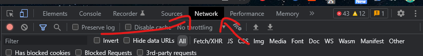
- **Lihat icon sebelah kiri samping tombol bulet merah**, tekan tombol tersebut. Hingga tampilannya bersih/kosong. 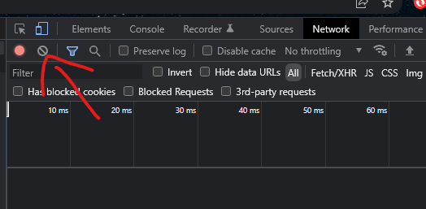
- Setelah itu refresh halaman beranda [Shopee](https://shopee.co.id/) (tekan F5). **Jangan tutup apapun, tetap masih ditab network**
- Tunggu beberapa saat.. hingga loading selesai pada address bar.
- Jika selesai, pencet lagi **icon sebelah kiri samping tombol bulet merah** 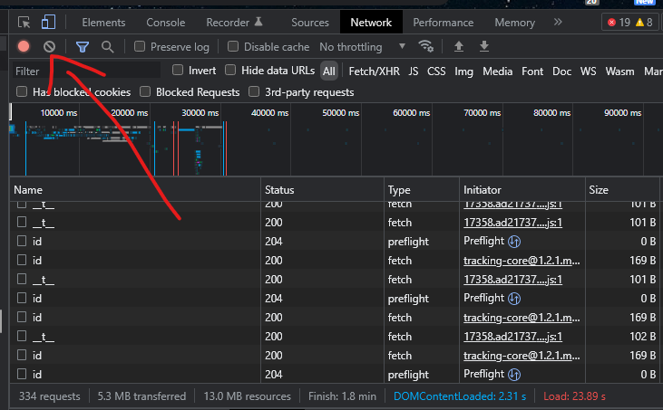
- Sekarang fokus bagian ini, scroll hingga bagian atas sendiri 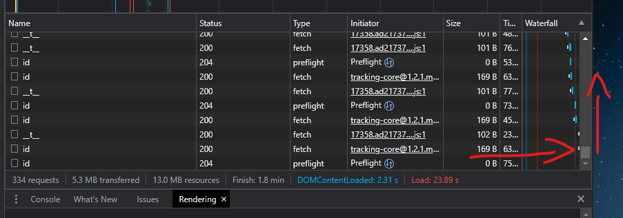
- Cari tulisan **/** atau **shopee.co.id**. **pilih Type berupa fetch bukan apapun**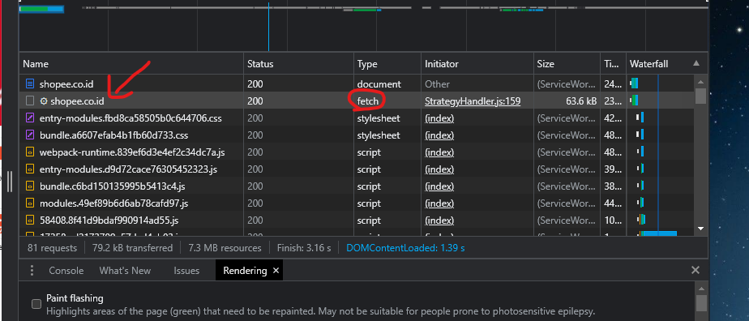. Setelah itu klik bagian tersebut. Tampilannya seperti ini. 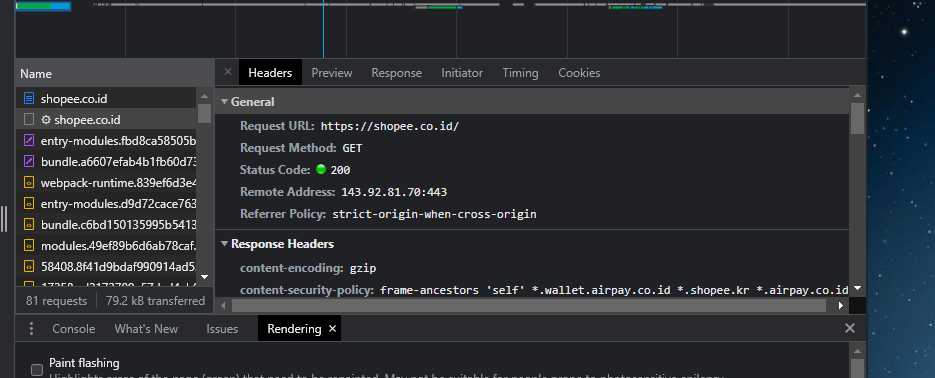
- Lalu scroll pelan-pelan kebawah 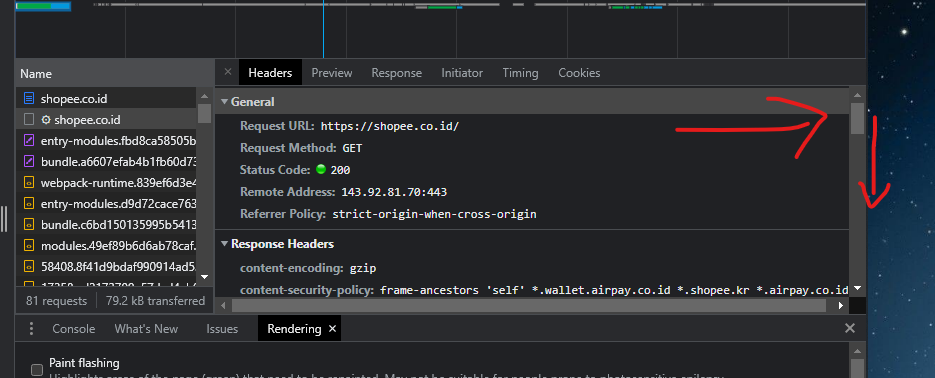
- Scroll pelan-pelan, cari bagian **Request Headers** lalu didalamnya ada **cookie** seperti gambar berikut 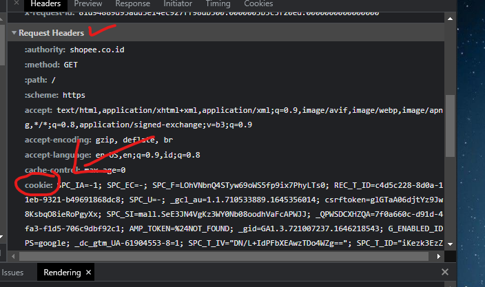
- Klik pada area **cookie** 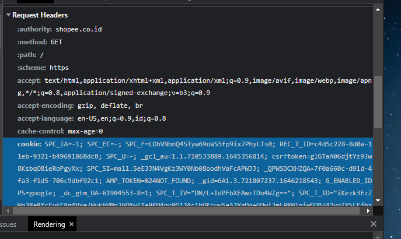
- Klik kanan, lalu klik **copy value** 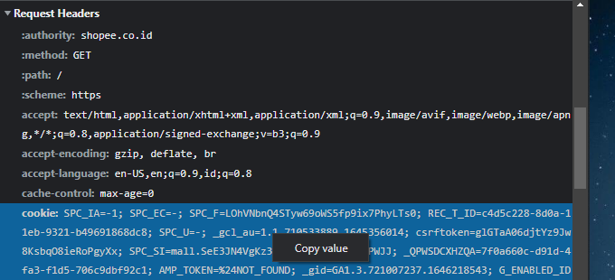
- Setelah mendapatkan value cookie, silahkan buka file .env sesuai sistem operasimu. Jika menggunakan windows silahkan ubah [.env](windows/.env) di folder windows, jika menggunakan linux silahkan ubah [.env](linux/.env) di folder linux.
- Buka file .env bisa melalui notepad maupun text editor lainnya.
- Paste/tempel kan pada file .env pada bidang **COOKIE=**, setelah **sama dengan(=)** dan **tanpa spasi**, letakkan disitu.
- Tetap pada dibrowsermu, silahkan kunjungi [my-user-agent.com](http://my-user-agent.com/).
- Silahkan copy setelah kata *Your user agent:* 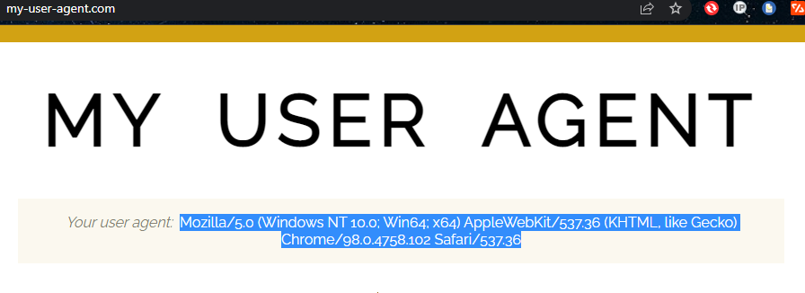
- Setelah itu paste/tempel kan pada file .env pada bidang **USERAGENT=**, setelah **sama dengan(=)** dan **tanpa spasi**, letakkan disitu.
- Lalu tinggal pilih item barang belanjaan yang kalian inginkan.
- Jika sudah menemukan item barangnya, silahkan copy url tersebut lalu paste/tempel kan pada file .env pada bidang **URLBARANG=**, setelah **sama dengan(=)** dan **tanpa spasi**, letakkan disitu.
- Pada file **.env** silahkan tekan tombol **ctrl+f**, lalu ketik **shopee_webUnique_ccd=**, maka akan menampilkan valuenya. Silahkan copy value tersebut lalu paste ke file .env pada bidang **KEYBELANJA=**, setelah **sama dengan(=)** dan **tanpa spasi**, letakkan disitu.
    Contohnya
    file cookieku berisikan
    ```
    TNE; shopee_webUnique_ccd=JYJlgvUSJx1bUc90VIKjcg==|yj7IOVgkUZewl4udkMzaHmmQ4/ucTEEDiWcKzUB/ZAvaV52TxhRlMBOtjxfEgB5x2LVUTLo7lOOkOKvURCdGoYwBERA=|UcfYhm1rKo7Tc95v|05|3; SPC_EC=WTdm
    ```
    Maka value dari **shopee_webUnique_ccd=** adalah
    ```
    JYJlgvUSJx1bUc90VIKjcg==|yj7IOVgkUZewl4udkMzaHmmQ4/ucTEEDiWcKzUB/ZAvaV52TxhRlMBOtjxfEgB5x2LVUTLo7lOOkOKvURCdGoYwBERA=|UcfYhm1rKo7Tc95v|05|3
    ```
    "**INGAT SETELAH = HINGGA SEBELUM ;**"
- Silahkan pilih model dari produk yang tersedia.
    Caranya ketik perintah pada *git bash/terminal* comand dibawah ini
    ```bash
    ./pilih-item
    ```
    Otomatis akan menampilkan list model yang dimiliki produk.
    Silahkan pilih no modelnya yang ada tulisan **No. [x]**.
    Setelah itu isikan pada file .env pada bidang **MODEL=**, setelah **sama dengan(=)** dan **tanpa spasi**, letakkan disitu.
- Kita build project terlebih dahulu agar lebih tingan.
    ```bash
    go build .
    ```
    **inget pake titik**
- Lalu tinggal jalankan scriptnya.
    - Windows
        - Masuk ke direktori setelah mendownload file tadi.
        - klik pada address bar file explorer, ketikkan cmd. 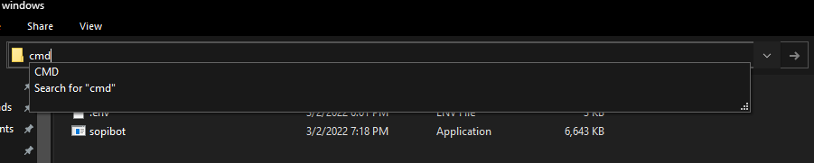 lalu enter
        - ketikkan perintah berikut untuk menjalankan script
            ```bash
            sopibot.exe
            ```
        - Jika dianggap virus oleh komputer, silahkan matikan sementara antivirusnya. Program sepenuhnya hasil compile bahasa pemrograman Go. **Jadi tidak mengandung virus apapun**.
    - Linux
        - Masuk ke direktori setelah mendownload file tadi.
        - Buka terminal
        - ketikkan perintah berikut untuk menjalankan script
            ```bash
            ./sopibot
            ```
- Jika flashsale, silahkan ulangi lagi dan lagi hingga item belanja masuk ke keranjang belanja, bisa menggunakan shell file seperti pada file [ini](gaskeun.sh).

### Important
- Jika mengalami seperti pada gambar ini 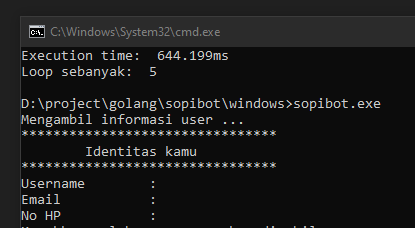
    Maka kamu harus menjalankan ulang dari langkah 5. Kenapa? karena sessionmu sudah habis pada cookie tersebut, kamu diharuskan memperbarui cookiemu tersebut.
- Setelah berhasil checkout, kamu harus menjalankan ulang dari langkah 5. Kenapa? karena pada key **shopee_webUnique_ccd=** telah berubah dari server, kamu diharuskan memperbarui value tersebut.

## Support Me
Dukung aku [https://saweria.co/afrizalmy](https://saweria.co/afrizalmy)
